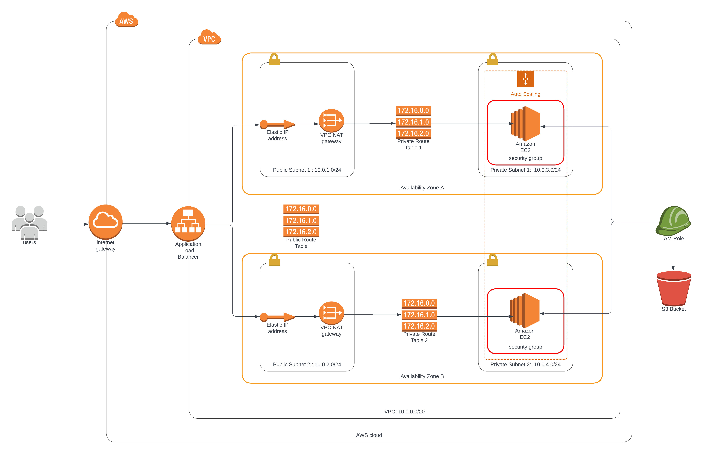

# cloudformation-high-availability-webapp
Uses cloudformation to provide an highly available web application

### Web application
Load balancer DNS: [http://udama-webap-142miqsr4v756-2056057160.us-east-1.elb.amazonaws.com](http://udama-webap-142miqsr4v756-2056057160.us-east-1.elb.amazonaws.com)

### AWS Cloud Architecture

